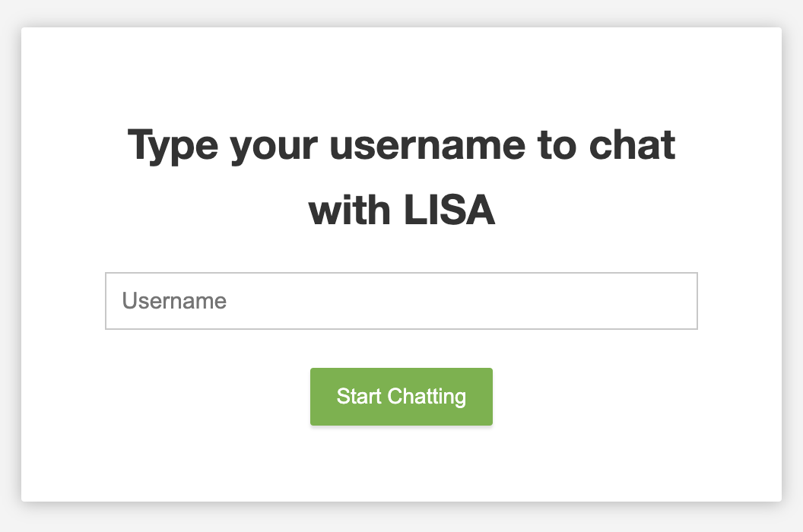
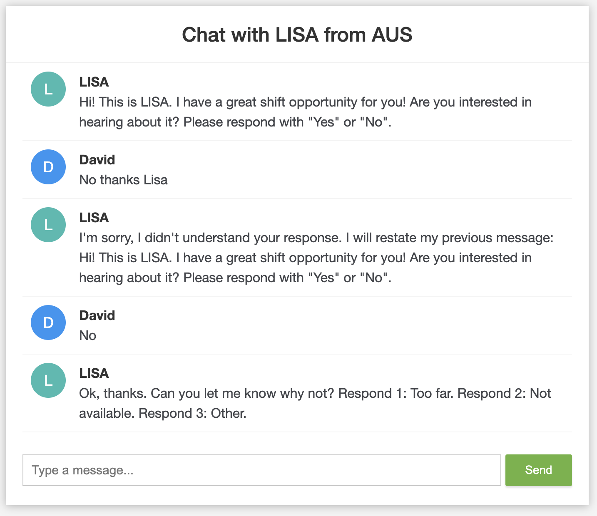

# Spring-Boot Chatbot Application

A full-stack chatbot application using SpringBoot for backend, H2 for the relational database, and plain HTML/CSS/JavaScript for the frontend.

To see the original project description, scroll to the bottom.

## How to Run

### Run App Via Command Line

Check your Maven installation with `mvn -v`. If maven is not installed or your version of Java is older than 17, please install the dependencies or consider using IntelliJ. See below for an example `mvn -v` output.

```
Apache Maven 3.9.4 (dfbb324ad4a7c8fb0bf182e6d91b0ae20e3d2dd9)
Maven home: /Users/eduong/apache-maven-3.9.4
Java version: 17.0.8, vendor: Amazon.com Inc., runtime: /Users/eduong/Library/Java/JavaVirtualMachines/corretto-17.0.8/Contents/Home
Default locale: en_US, platform encoding: UTF-8
OS name: "mac os x", version: "13.5", arch: "aarch64", family: "mac"
```

1. Clone the repository with `git clone https://github.com/AUS-Candidate-Rep/Ethan_Duong.git` 
2. Move to chatbot directory with `cd Ethan_Duong`
3. Checkout the correct branch with `git checkout AUS_Ethan_Duong`
4. `cd chatbot`
5. Run the app with: `mvn spring-boot:run`
6. Open http://localhost:8080/ in a browser of your choice (I use Chrome)

### Run App Via IntelliJ

Please install IntelliJ community edition [here](https://www.jetbrains.com/idea/download/). Follow these [instructions](https://www.baeldung.com/intellij-change-java-version) to use Java 17 within IntelliJ (Version 20 also works).

1. Do steps 1-3 of the previous section if you haven't already.
2. Open IntelliJ
3. Open the `chatbot` folder as a project. Select trust project. 
4. In the IntelliJ navigation bar, expand `src`, then `main`, and then `java`. 
5. Right click the `ChatBotApplication` file that appears. Click `run ChatBotApplication...main()` in the popup.
6. Open http://localhost:8080/ in a browser of your choice (I use Chrome)

## Project Overview




### Decision Tree Data Structure

Internally, the chat flow is designed as a decision tree. The tree is generated during runtime by reading the contents of the `questions` table in the H2 database. This allows us to change the question flow without actually writing any new Java. In a production environement, we can update the contents of the `questions` table without redeploying the Spring app.

Please see `src/main/java/.../services/DecisionTreeService.java` for the business logic governing the tree.

### Database Schema

See the below SQL DDL. Note that H2 is an in-memory database meant for prototypes. Thus tables are created and populated when the app is started meaning no extra work needs to be done on your part :)

```
CREATE TABLE chat_logs (
    id BIGINT NOT NULL,
    timestamp TIMESTAMP(6),
    message VARCHAR(255),
    response VARCHAR(255),
    username VARCHAR(255) NOT NULL,
    action VARCHAR(255),
    PRIMARY KEY (id)
);
CREATE TABLE chat_state (
    id BIGINT NOT NULL,
    state VARCHAR(255) NOT NULL,
    username VARCHAR(255) NOT NULL UNIQUE,
    PRIMARY KEY (id)
);
CREATE TABLE questions (
    id BIGINT NOT NULL,
    name VARCHAR(255) NOT NULL UNIQUE,
    parent VARCHAR(255),
    previous_decision VARCHAR(255),
    text VARCHAR(255) NOT NULL,
    PRIMARY KEY (id)
);
```

These tables are only ever used separately in practice and are never joined by the application. Thus, the only relation is between `chat_state` and `chat_logs` via username (1 to many). 

### Testing

The business logic of this application is mostly kept within the `DecisionTreeService` class. Unit tests are written for both the web and service layers of this application with particular focus on edge cases within the `DecisionTreeService` class. 

The tests are located in `src/test/java`. You can run them in IntelliJ by right clicking the `java` folder and selecting `run tests`. 